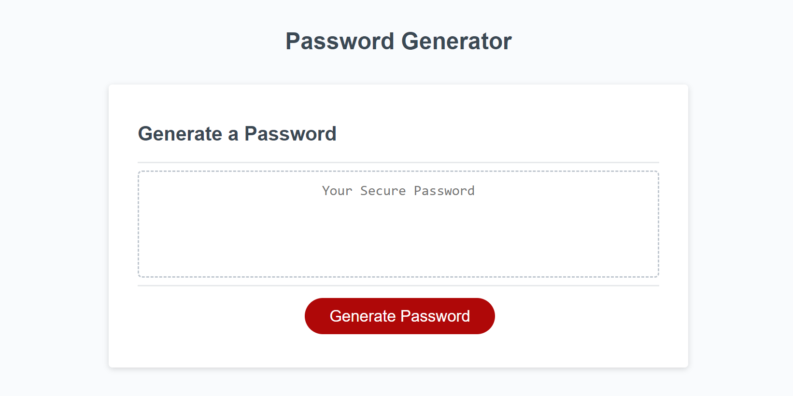

# password-generator

<a href="https://laurencaudle1234.github.io/html-portfolio/">Project</a>

What was my motivation?

My motivation was to generate a password generator that would include, a length limit, lower and upper case letters, and special characters. The Acceptance Criteria to do so is as follows:

GIVEN I need to sample a potential employee's previous work
GIVEN I need a new, secure password
WHEN I click the button to generate a password
THEN I am presented with a series of prompts for password criteria
WHEN prompted for password criteria
THEN I select which criteria to include in the password
WHEN prompted for the length of the password
THEN I choose a length of at least 8 characters and no more than 128 characters
WHEN asked for character types to include in the password
THEN I confirm whether or not to include lowercase, uppercase, numeric, and/or special characters
WHEN I answer each prompt
THEN my input should be validated and at least one character type should be selected
WHEN all prompts are answered
THEN a password is generated that matches the selected criteria
WHEN the password is generated
THEN the password is either displayed in an alert or written to the page

Why did I build this project?

I built this project to generator a password within the acceptance criteria. 

What problem did I solve? 

I solved the problem of making sure a the generated password thats meets all the expected criteria. 

What did I learn?

I learned that through javascript, i can create a password using specific criteria. 
 